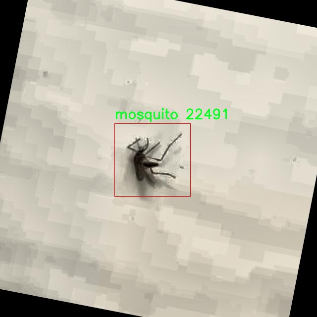

# 蚊子检测检测系统源码分享
 # [一条龙教学YOLOV8标注好的数据集一键训练_70+全套改进创新点发刊_Web前端展示]

### 1.研究背景与意义

项目参考[AAAI Association for the Advancement of Artificial Intelligence](https://gitee.com/qunmasj/projects)

项目来源[AACV Association for the Advancement of Computer Vision](https://kdocs.cn/l/cszuIiCKVNis)

研究背景与意义

随着全球气候变化和城市化进程的加快，蚊子作为一种重要的病媒生物，其传播的疾病对公共健康构成了严重威胁。根据世界卫生组织的统计，蚊子传播的疾病每年导致数十万人死亡，尤其是在热带和亚热带地区，登革热、疟疾和寨卡病毒等蚊媒疾病的流行频率逐年上升。因此，针对蚊子的监测与控制成为了公共卫生领域亟待解决的重要课题。传统的蚊子监测方法主要依赖人工捕捉和观察，效率低下且容易受到人为因素的影响，难以实现大规模、实时的监测。

近年来，计算机视觉技术的迅猛发展为蚊子检测提供了新的解决方案。YOLO（You Only Look Once）系列模型因其高效的实时目标检测能力而受到广泛关注。YOLOv8作为该系列的最新版本，具备更强的特征提取能力和更快的处理速度，适合在复杂环境中进行目标检测。然而，针对蚊子的特定检测任务，现有的YOLOv8模型仍存在一定的局限性，尤其是在小目标检测和背景复杂情况下的准确性。因此，基于改进YOLOv8的蚊子检测系统的研究具有重要的理论和实践意义。

本研究将基于一个包含9900张蚊子图像的数据集，进行YOLOv8模型的改进与优化。该数据集专注于蚊子这一单一类别，能够为模型提供丰富的样本数据，有助于提升模型的训练效果和检测精度。通过对数据集的深入分析与处理，我们将探讨如何增强模型对蚊子特征的学习能力，尤其是在不同光照、角度和背景下的表现。改进的方向可能包括数据增强技术的应用、模型结构的调整以及损失函数的优化等，以期提升模型在实际应用中的鲁棒性和准确性。

此外，本研究的成果不仅能够为蚊子监测提供一种高效的技术手段，还能够为其他病媒生物的检测提供借鉴。通过将计算机视觉技术与公共卫生需求相结合，我们希望能够推动智能监测系统的发展，为蚊媒疾病的防控提供科学依据和技术支持。未来，基于改进YOLOv8的蚊子检测系统有望应用于实际的蚊子监测项目中，为公共卫生管理提供实时数据支持，帮助相关部门及时采取防控措施，降低蚊媒疾病的传播风险。

综上所述，基于改进YOLOv8的蚊子检测系统的研究，不仅具有重要的学术价值，也具有广泛的社会意义。通过提升蚊子检测的效率和准确性，我们能够为全球公共卫生安全贡献一份力量，推动人类对抗蚊媒疾病的斗争向前迈进一大步。

### 2.图片演示


##### 注意：由于此博客编辑较早，上面“2.图片演示”和“3.视频演示”展示的系统图片或者视频可能为老版本，新版本在老版本的基础上升级如下：（实际效果以升级的新版本为准）

  （1）适配了YOLOV8的“目标检测”模型和“实例分割”模型，通过加载相应的权重（.pt）文件即可自适应加载模型。

  （2）支持“图片识别”、“视频识别”、“摄像头实时识别”三种识别模式。

  （3）支持“图片识别”、“视频识别”、“摄像头实时识别”三种识别结果保存导出，解决手动导出（容易卡顿出现爆内存）存在的问题，识别完自动保存结果并导出到tempDir中。

  （4）支持Web前端系统中的标题、背景图等自定义修改，后面提供修改教程。

  另外本项目提供训练的数据集和训练教程,暂不提供权重文件（best.pt）,需要您按照教程进行训练后实现图片演示和Web前端界面演示的效果。

### 3.视频演示

[3.1 视频演示](https://www.bilibili.com/video/BV1AatBeCEf7/)

### 4.数据集信息展示

##### 4.1 本项目数据集详细数据（类别数＆类别名）

nc: 1
names: ['mosquito']


##### 4.2 本项目数据集信息介绍

数据集信息展示

在本研究中，我们采用了名为“Mosquito”的数据集，以支持对YOLOv8模型的改进，旨在提升蚊子检测系统的性能。该数据集专门针对蚊子这一特定目标进行构建，具有独特的应用价值和研究意义。蚊子作为传播多种疾病的媒介，其监测与控制在公共卫生领域中占据着重要地位。因此，开发高效的蚊子检测系统不仅有助于科学研究，还能为疾病预防和控制提供技术支持。

“Mosquito”数据集的设计理念是为深度学习模型提供高质量的训练样本，以便模型能够准确识别和定位蚊子。该数据集的类别数量为1，专注于“mosquito”这一目标。这种单一类别的设置使得数据集在特定任务上的表现更加精准，减少了模型在多类别检测时可能出现的混淆。通过专注于蚊子这一类别，研究人员能够深入分析模型在特定场景下的表现，从而为后续的优化提供依据。

数据集中的图像样本涵盖了多种环境和背景，确保模型在不同条件下的鲁棒性。这些样本可能包括室内和室外的场景，白天和夜晚的光照条件，以及不同的蚊子种类和姿态。这种多样性使得模型在实际应用中能够更好地适应各种复杂的环境，提高了检测的准确性和可靠性。此外，数据集中还可能包含不同分辨率和清晰度的图像，以模拟现实世界中可能遇到的各种情况。

在数据集的标注方面，所有图像均经过精确的标注，确保每一只蚊子都被准确框定。这种高质量的标注对于训练深度学习模型至关重要，因为它直接影响到模型的学习效果和最终的检测性能。研究人员在标注过程中，采用了严格的标准，以确保每个样本的标注一致性和准确性。这种严谨的标注流程不仅提高了数据集的可信度，也为模型的训练提供了坚实的基础。

通过使用“Mosquito”数据集，研究团队能够有效地训练和评估改进后的YOLOv8模型。该模型在经过充分的训练后，预计将具备更高的检测精度和更快的响应速度，能够在实时监测系统中发挥重要作用。这一进展不仅有助于科学研究，还将为公共卫生领域提供更为有效的蚊子监测解决方案，进而推动蚊子传播疾病的防控工作。

总之，“Mosquito”数据集的构建与应用为蚊子检测系统的研究提供了重要的支持。通过高质量的图像样本和精准的标注，研究人员能够在深度学习领域取得更为显著的成果，为蚊子监测和控制技术的发展贡献力量。未来，随着数据集的不断扩展和优化，预计将会有更多的研究者参与到这一领域，为公共卫生事业的发展提供新的思路和方法。





### 5.全套项目环境部署视频教程（零基础手把手教学）

[5.1 环境部署教程链接（零基础手把手教学）](https://www.ixigua.com/7404473917358506534?logTag=c807d0cbc21c0ef59de5)


[5.2 安装Python虚拟环境创建和依赖库安装视频教程链接（零基础手把手教学）](https://www.ixigua.com/7404474678003106304?logTag=1f1041108cd1f708b01a)

### 6.手把手YOLOV8训练视频教程（零基础小白有手就能学会）

[6.1 手把手YOLOV8训练视频教程（零基础小白有手就能学会）](https://www.ixigua.com/7404477157818401292?logTag=d31a2dfd1983c9668658)

### 7.70+种全套YOLOV8创新点代码加载调参视频教程（一键加载写好的改进模型的配置文件）

[7.1 70+种全套YOLOV8创新点代码加载调参视频教程（一键加载写好的改进模型的配置文件）](https://www.ixigua.com/7404478314661806627?logTag=29066f8288e3f4eea3a4)

### 8.70+种全套YOLOV8创新点原理讲解（非科班也可以轻松写刊发刊，V10版本正在科研待更新）

由于篇幅限制，每个创新点的具体原理讲解就不一一展开，具体见下列网址中的创新点对应子项目的技术原理博客网址【Blog】：


[8.1 70+种全套YOLOV8创新点原理讲解链接](https://gitee.com/qunmasj/good)

### 9.系统功能展示（检测对象为举例，实际内容以本项目数据集为准）

图9.1.系统支持检测结果表格显示

  图9.2.系统支持置信度和IOU阈值手动调节

  图9.3.系统支持自定义加载权重文件best.pt(需要你通过步骤5中训练获得)

  图9.4.系统支持摄像头实时识别

  图9.5.系统支持图片识别

  图9.6.系统支持视频识别

  图9.7.系统支持识别结果文件自动保存

  图9.8.系统支持Excel导出检测结果数据


### 10.原始YOLOV8算法原理

原始YOLOv8算法原理

YOLOv8算法作为目标检测领域的最新代表，继承并发展了YOLO系列模型的优良传统，尤其是在精度和效率方面的卓越表现，使其成为当前最为先进的计算机视觉模型之一。其设计理念基于对前几代YOLO模型的深刻理解与创新，旨在解决目标检测中面临的多种挑战，尤其是在小目标检测和高分辨率图像处理方面的需求。

在YOLOv8的架构中，骨干网络（Backbone）采用了跨阶段局部网络（CSP）的设计理念，这一结构通过引入更多的跳层连接和分支操作，显著提升了特征提取的效率和准确性。与YOLOv5相比，YOLOv8对C3模块进行了优化，替换为更为轻量的C2f模块。这一变化不仅减小了模型的复杂度，还在特征提取过程中保持了高效性，确保了在多种硬件平台上的流畅运行。

YOLOv8的特征融合策略同样值得关注。其Neck部分通过多尺度特征融合技术，将来自不同阶段的特征图进行有效整合，增强了模型对不同尺度目标的感知能力。这种设计使得YOLOv8在处理复杂场景时，能够更好地捕捉到小目标和大目标的特征信息，从而提升了整体的检测性能和鲁棒性。

在目标检测的核心环节——Head部分，YOLOv8采用了全新的解耦检测头，取代了传统的耦合检测头。这一创新使得模型能够独立处理分类和回归任务，进而提高了检测的精度和效率。此外，YOLOv8引入了无锚点（Anchor-Free）检测策略，省去了传统锚框的设计，使得模型在面对不同形状和尺寸的目标时，能够更灵活地进行适应。

YOLOv8的损失函数设计也进行了显著改进。通过引入变焦损失（Focal Loss）来计算分类损失，以及数据平均保真度损失和完美交并比损失来评估边界框的损失，这一新策略使得模型在训练过程中能够更有效地聚焦于难以检测的目标，进一步提升了检测的准确性。这种损失函数的设计不仅增强了模型的学习能力，也为其在实际应用中的表现提供了有力保障。

值得一提的是，YOLOv8在保持高效性的同时，依然注重模型的易用性和工程化。其新的PyTorch训练和部署框架，使得用户在自定义模型训练时，能够更加便捷地进行操作，降低了使用门槛。这一设计理念使得YOLOv8不仅适用于学术研究，也为工业界的实际应用提供了强有力的支持。

YOLOv8的创新不仅体现在结构和算法层面，还包括其对多种任务的支持能力。除了传统的目标检测，YOLOv8还扩展了对姿态评估的支持，能够在复杂场景中进行更为细致的分析。此外，YOLOv8的多种网络结构（如YOLOv8n、YOLOv8s、YOLOv8m、YOLOv8l和YOLOv8x）为不同应用场景提供了灵活的选择，使得用户能够根据实际需求选择合适的模型。

综上所述，YOLOv8算法通过对骨干网络、特征融合、检测头和损失函数等多个方面的优化，展现出了卓越的目标检测能力。其在精度和效率上的全面提升，使得YOLOv8成为计算机视觉领域中一款不可或缺的工具。随着技术的不断进步，YOLOv8无疑将在更多的应用场景中发挥重要作用，推动目标检测技术的进一步发展。


### 11.项目核心源码讲解（再也不用担心看不懂代码逻辑）

#### 11.1 ui.py

以下是经过精简和注释的核心代码部分：

```python
import sys
import subprocess

def run_script(script_path):
    """
    使用当前 Python 环境运行指定的脚本。

    Args:
        script_path (str): 要运行的脚本路径
    """
    # 获取当前 Python 解释器的路径
    python_path = sys.executable

    # 构建运行命令，使用 streamlit 运行指定的脚本
    command = f'"{python_path}" -m streamlit run "{script_path}"'

    # 执行命令，并检查返回状态
    result = subprocess.run(command, shell=True)
    if result.returncode != 0:
        print("脚本运行出错。")

# 主程序入口
if __name__ == "__main__":
    # 指定要运行的脚本路径
    script_path = "web.py"  # 假设脚本在当前目录下

    # 调用函数运行脚本
    run_script(script_path)
```

### 代码注释说明：

1. **导入模块**：
   - `sys`：用于访问与 Python 解释器相关的变量和函数。
   - `subprocess`：用于执行外部命令。

2. **定义 `run_script` 函数**：
   - 该函数接受一个参数 `script_path`，表示要运行的 Python 脚本的路径。
   - 使用 `sys.executable` 获取当前 Python 解释器的路径，以确保使用正确的 Python 环境。
   - 构建一个命令字符串，使用 `streamlit` 运行指定的脚本。
   - 使用 `subprocess.run` 执行构建的命令，并检查返回状态码。如果返回码不为 0，表示脚本运行出错，打印错误信息。

3. **主程序入口**：
   - 使用 `if __name__ == "__main__":` 确保只有在直接运行该脚本时才会执行以下代码。
   - 指定要运行的脚本路径（在此示例中为 `web.py`）。
   - 调用 `run_script` 函数来执行指定的脚本。

这个程序文件 `ui.py` 是一个用于运行 Python 脚本的简单工具，主要功能是通过当前的 Python 环境来执行指定的脚本。在这个文件中，首先导入了必要的模块，包括 `sys`、`os` 和 `subprocess`，这些模块提供了与系统交互和执行外部命令的功能。此外，还导入了 `QtFusion.path` 模块中的 `abs_path` 函数，用于获取脚本的绝对路径。

在 `run_script` 函数中，首先获取当前 Python 解释器的路径，这样可以确保在正确的环境中运行脚本。接着，构建了一个命令字符串，该命令使用 `streamlit` 模块来运行指定的脚本。`streamlit` 是一个用于构建数据应用的框架，因此这里的脚本很可能是一个使用 `streamlit` 编写的 Web 应用。

随后，使用 `subprocess.run` 方法执行构建好的命令。这个方法会在一个新的 shell 中运行命令，并等待其完成。如果命令执行的返回码不为零，表示脚本运行过程中出现了错误，此时会打印出“脚本运行出错”的提示信息。

在文件的最后部分，使用 `if __name__ == "__main__":` 语句来确保只有在直接运行该文件时才会执行后面的代码。在这里，首先调用 `abs_path` 函数来获取 `web.py` 脚本的绝对路径，然后调用 `run_script` 函数来运行这个脚本。

总体来说，这个程序的主要作用是为用户提供一个简单的接口，以便在当前 Python 环境中运行一个名为 `web.py` 的脚本，并通过 `streamlit` 框架来展示其功能。

#### 11.2 70+种YOLOv8算法改进源码大全和调试加载训练教程（非必要）\ultralytics\models\sam\amg.py

以下是代码中最核心的部分，并附上详细的中文注释：

```python
import torch

def is_box_near_crop_edge(boxes: torch.Tensor,
                          crop_box: List[int],
                          orig_box: List[int],
                          atol: float = 20.0) -> torch.Tensor:
    """
    判断给定的边界框是否接近裁剪边缘。

    参数：
    - boxes: 需要检查的边界框，格式为 (x1, y1, x2, y2) 的张量。
    - crop_box: 当前裁剪框的边界，格式为 [x0, y0, x1, y1]。
    - orig_box: 原始图像的边界框，格式为 [x0, y0, x1, y1]。
    - atol: 允许的绝对误差，默认为 20.0。

    返回：
    - 返回一个布尔张量，指示每个边界框是否接近裁剪边缘。
    """
    # 将裁剪框和原始框转换为张量
    crop_box_torch = torch.as_tensor(crop_box, dtype=torch.float, device=boxes.device)
    orig_box_torch = torch.as_tensor(orig_box, dtype=torch.float, device=boxes.device)
    
    # 将边界框转换为未裁剪的坐标
    boxes = uncrop_boxes_xyxy(boxes, crop_box).float()
    
    # 检查边界框是否接近裁剪框的边缘
    near_crop_edge = torch.isclose(boxes, crop_box_torch[None, :], atol=atol, rtol=0)
    # 检查边界框是否接近原始图像的边缘
    near_image_edge = torch.isclose(boxes, orig_box_torch[None, :], atol=atol, rtol=0)
    
    # 只有当边界框接近裁剪边缘且不接近原始图像边缘时，才返回 True
    near_crop_edge = torch.logical_and(near_crop_edge, ~near_image_edge)
    
    # 返回是否有任何边界框接近裁剪边缘
    return torch.any(near_crop_edge, dim=1)


def uncrop_boxes_xyxy(boxes: torch.Tensor, crop_box: List[int]) -> torch.Tensor:
    """
    将裁剪的边界框转换为原始图像坐标。

    参数：
    - boxes: 裁剪后的边界框，格式为 (x1, y1, x2, y2) 的张量。
    - crop_box: 当前裁剪框的边界，格式为 [x0, y0, x1, y1]。

    返回：
    - 返回未裁剪的边界框。
    """
    x0, y0, _, _ = crop_box
    # 创建偏移量张量
    offset = torch.tensor([[x0, y0, x0, y0]], device=boxes.device)
    
    # 检查 boxes 是否有通道维度
    if len(boxes.shape) == 3:
        offset = offset.unsqueeze(1)
    
    # 返回未裁剪的边界框
    return boxes + offset


def batched_mask_to_box(masks: torch.Tensor) -> torch.Tensor:
    """
    计算掩膜周围的边界框，返回格式为 XYXY。

    参数：
    - masks: 二进制掩膜，形状为 C1xC2x...xHxW。

    返回：
    - 形状为 C1xC2x...x4 的边界框张量。
    """
    # 如果掩膜为空，返回 [0, 0, 0, 0]
    if torch.numel(masks) == 0:
        return torch.zeros(*masks.shape[:-2], 4, device=masks.device)

    # 规范化形状为 CxHxW
    shape = masks.shape
    h, w = shape[-2:]
    masks = masks.flatten(0, -3) if len(shape) > 2 else masks.unsqueeze(0)
    
    # 获取上边和下边的坐标
    in_height, _ = torch.max(masks, dim=-1)
    in_height_coords = in_height * torch.arange(h, device=in_height.device)[None, :]
    bottom_edges, _ = torch.max(in_height_coords, dim=-1)
    in_height_coords = in_height_coords + h * (~in_height)
    top_edges, _ = torch.min(in_height_coords, dim=-1)

    # 获取左边和右边的坐标
    in_width, _ = torch.max(masks, dim=-2)
    in_width_coords = in_width * torch.arange(w, device=in_width.device)[None, :]
    right_edges, _ = torch.max(in_width_coords, dim=-1)
    in_width_coords = in_width_coords + w * (~in_width)
    left_edges, _ = torch.min(in_width_coords, dim=-1)

    # 如果掩膜为空，右边缘在左边缘左侧，替换为 [0, 0, 0, 0]
    empty_filter = (right_edges < left_edges) | (bottom_edges < top_edges)
    out = torch.stack([left_edges, top_edges, right_edges, bottom_edges], dim=-1)
    out = out * (~empty_filter).unsqueeze(-1)

    # 返回到原始形状
    return out.reshape(*shape[:-2], 4) if len(shape) > 2 else out[0]
```

### 代码核心部分说明：
1. **`is_box_near_crop_edge`**: 判断边界框是否接近裁剪框的边缘，主要用于图像处理中的边界检测。
2. **`uncrop_boxes_xyxy`**: 将裁剪后的边界框转换为原始图像坐标，确保后续处理能够使用正确的坐标。
3. **`batched_mask_to_box`**: 从二进制掩膜中计算出边界框，适用于目标检测任务，输出格式为 XYXY，便于后续的处理和分析。

这个程序文件是与YOLOv8算法相关的一个模块，主要涉及图像处理和目标检测中的一些辅助功能。代码中使用了PyTorch和NumPy库，提供了一系列函数来处理边界框、掩膜、图像裁剪等操作。

首先，`is_box_near_crop_edge`函数用于判断给定的边界框是否接近裁剪边缘。它接收边界框、裁剪框和原始框的坐标，并通过比较这些框的位置来返回一个布尔张量，指示哪些框接近裁剪边缘。

接下来的`batch_iterator`函数用于生成数据的批次迭代器，确保输入参数的长度一致，并根据指定的批次大小将数据分成多个批次进行处理。

`calculate_stability_score`函数计算一组掩膜的稳定性分数。它通过对掩膜进行阈值处理，计算二进制掩膜之间的交并比（IoU），以评估掩膜的稳定性。

`build_point_grid`和`build_all_layer_point_grids`函数用于生成均匀分布的点网格，适用于图像的不同裁剪层次。这些点可以用于后续的图像处理和特征提取。

`generate_crop_boxes`函数生成不同大小的裁剪框，依据图像的尺寸和层数来计算每层的裁剪框。它通过重叠比例和裁剪数量来决定每个裁剪框的大小和位置。

`uncrop_boxes_xyxy`、`uncrop_points`和`uncrop_masks`函数则用于将裁剪后的边界框、点和掩膜还原到原始图像的坐标系中。这些函数通过添加裁剪框的偏移量来实现这一点。

`remove_small_regions`函数用于去除掩膜中的小区域或孔洞。它利用OpenCV库中的连通组件分析来识别和处理小的、不连通的区域。

最后，`batched_mask_to_box`函数用于计算掩膜周围的边界框，返回的格式为XYXY。该函数处理了空掩膜的情况，并确保输出的形状与输入相匹配。

总体而言，这个模块提供了一系列工具，旨在支持YOLOv8算法在目标检测任务中的图像处理和后处理步骤。通过这些函数，用户可以有效地管理和操作图像数据，提升模型的性能和准确性。

#### 11.3 code\ultralytics\utils\callbacks\dvc.py

以下是代码中最核心的部分，并附上详细的中文注释：

```python
# 导入必要的库
from ultralytics.utils import LOGGER, SETTINGS, TESTS_RUNNING, checks

try:
    # 确保当前不是在测试环境中
    assert not TESTS_RUNNING  
    # 确保DVC集成已启用
    assert SETTINGS["dvc"] is True  
    import dvclive  # 导入DVCLive库

    # 检查DVCLive版本
    assert checks.check_version("dvclive", "2.11.0", verbose=True)

    import os
    import re
    from pathlib import Path

    # DVCLive日志记录实例
    live = None
    _processed_plots = {}  # 存储已处理的图表

    # 用于区分最佳模型的最终评估与最后一个epoch的验证
    _training_epoch = False

except (ImportError, AssertionError, TypeError):
    dvclive = None  # 如果导入失败，dvclive设置为None


def _log_images(path, prefix=""):
    """使用DVCLive记录指定路径的图像，带有可选前缀。"""
    if live:  # 如果DVCLive实例存在
        name = path.name

        # 按批次分组图像，以便在UI中启用滑块
        m = re.search(r"_batch(\d+)", name)
        if m:
            ni = m[1]
            new_stem = re.sub(r"_batch(\d+)", "_batch", path.stem)
            name = (Path(new_stem) / ni).with_suffix(path.suffix)

        # 记录图像
        live.log_image(os.path.join(prefix, name), path)


def on_pretrain_routine_start(trainer):
    """在预训练例程开始时初始化DVCLive日志记录器。"""
    try:
        global live
        live = dvclive.Live(save_dvc_exp=True, cache_images=True)  # 创建DVCLive实例
        LOGGER.info("DVCLive is detected and auto logging is enabled (run 'yolo settings dvc=False' to disable).")
    except Exception as e:
        LOGGER.warning(f"WARNING ⚠️ DVCLive installed but not initialized correctly, not logging this run. {e}")


def on_fit_epoch_end(trainer):
    """在每个训练epoch结束时记录训练指标和模型信息。"""
    global _training_epoch
    if live and _training_epoch:  # 如果DVCLive实例存在且当前为训练epoch
        all_metrics = {**trainer.label_loss_items(trainer.tloss, prefix="train"), **trainer.metrics, **trainer.lr}
        for metric, value in all_metrics.items():
            live.log_metric(metric, value)  # 记录每个指标

        # 记录模型信息
        if trainer.epoch == 0:
            from ultralytics.utils.torch_utils import model_info_for_loggers
            for metric, value in model_info_for_loggers(trainer).items():
                live.log_metric(metric, value, plot=False)

        # 记录训练和验证的图表
        _log_plots(trainer.plots, "train")
        _log_plots(trainer.validator.plots, "val")

        live.next_step()  # 进行到下一步
        _training_epoch = False  # 重置训练epoch标志


def on_train_end(trainer):
    """在训练结束时记录最佳指标、图表和混淆矩阵。"""
    if live:  # 如果DVCLive实例存在
        # 记录最佳指标
        all_metrics = {**trainer.label_loss_items(trainer.tloss, prefix="train"), **trainer.metrics, **trainer.lr}
        for metric, value in all_metrics.items():
            live.log_metric(metric, value, plot=False)

        # 记录验证图表和混淆矩阵
        _log_plots(trainer.plots, "val")
        _log_confusion_matrix(trainer.validator)

        if trainer.best.exists():
            live.log_artifact(trainer.best, copy=True, type="model")  # 记录最佳模型

        live.end()  # 结束日志记录


# 定义回调函数
callbacks = (
    {
        "on_pretrain_routine_start": on_pretrain_routine_start,
        "on_fit_epoch_end": on_fit_epoch_end,
        "on_train_end": on_train_end,
    }
    if dvclive
    else {}
)
```

### 代码核心部分说明：
1. **DVCLive的初始化**：在预训练开始时，创建一个DVCLive实例以便记录训练过程中的各种信息。
2. **图像和指标的记录**：在训练的每个epoch结束时，记录训练指标、模型信息以及图像，便于后续分析和可视化。
3. **回调函数**：定义了一系列回调函数，用于在训练的不同阶段执行特定的日志记录操作。

这个程序文件是用于Ultralytics YOLO模型训练过程中的回调函数实现，主要涉及到DVCLive的集成，用于实时记录和可视化训练过程中的各种指标和数据。首先，文件导入了一些必要的模块和库，包括Ultralytics的日志记录器和设置，以及DVCLive库。通过一些断言，确保在测试运行时不记录日志，并且确认DVCLive的集成已启用。

在程序中，定义了几个私有函数来处理不同类型的数据记录。`_log_images`函数用于记录指定路径下的图像，并支持通过前缀进行命名。它会根据图像名称中的批次信息进行分组，以便在用户界面中实现滑块功能。`_log_plots`函数用于记录训练过程中的图像数据，如果图像之前未被处理过，则会进行记录。`_log_confusion_matrix`函数则是用于记录混淆矩阵，它从验证器中提取目标和预测值，并使用DVCLive记录该矩阵。

接下来，定义了一系列回调函数，这些函数在训练的不同阶段被调用。`on_pretrain_routine_start`函数在预训练开始时初始化DVCLive记录器，并记录相关信息。如果初始化失败，会发出警告。`on_pretrain_routine_end`函数在预训练结束时记录训练过程中的图像数据。`on_train_start`函数在训练开始时记录训练参数。`on_train_epoch_start`函数在每个训练周期开始时设置一个全局变量，以指示当前处于训练周期中。

`on_fit_epoch_end`函数在每个训练周期结束时记录训练指标和模型信息，并进行下一步操作。它会记录所有的训练指标、损失、学习率等信息，并在第一轮时记录模型信息。`on_train_end`函数在训练结束时记录最佳指标、图像数据和混淆矩阵。如果最佳模型存在，还会将其记录为一个工件。

最后，定义了一个回调字典，根据DVCLive是否可用来决定是否注册这些回调函数。这些回调函数将会在训练的不同阶段被自动调用，以实现实时监控和记录训练过程中的重要数据。整体上，这个文件的主要目的是通过DVCLive实现对YOLO模型训练过程的可视化和监控。

#### 11.4 70+种YOLOv8算法改进源码大全和调试加载训练教程（非必要）\ultralytics\data\augment.py

以下是经过简化和注释的核心代码部分，主要集中在图像增强和转换的实现上：

```python
import random
import numpy as np
import cv2

class BaseTransform:
    """
    基础图像转换类，提供图像增强的基本框架。
    """

    def __init__(self) -> None:
        """初始化基础转换对象。"""
        pass

    def apply_image(self, labels):
        """应用图像转换到标签。"""
        pass

    def apply_instances(self, labels):
        """应用转换到标签中的对象实例。"""
        pass

    def apply_semantic(self, labels):
        """应用语义分割到图像。"""
        pass

    def __call__(self, labels):
        """调用所有标签转换。"""
        self.apply_image(labels)
        self.apply_instances(labels)
        self.apply_semantic(labels)


class Mosaic(BaseTransform):
    """
    马赛克增强类，通过将多个图像组合成一个马赛克图像来进行增强。
    """

    def __init__(self, dataset, imgsz=640, p=1.0, n=4):
        """初始化马赛克增强对象。"""
        assert 0 <= p <= 1.0, f'概率应在[0, 1]范围内，但得到的是 {p}.'
        assert n in (4, 9), '网格必须为4或9。'
        self.dataset = dataset
        self.imgsz = imgsz
        self.p = p
        self.n = n

    def get_indexes(self):
        """返回数据集中随机索引的列表。"""
        return random.sample(range(len(self.dataset)), self.n - 1)

    def _mix_transform(self, labels):
        """应用马赛克增强到标签字典。"""
        return self._mosaic4(labels) if self.n == 4 else self._mosaic9(labels)

    def _mosaic4(self, labels):
        """创建2x2的图像马赛克。"""
        mosaic_labels = []
        s = self.imgsz
        # 随机中心位置
        yc, xc = (random.randint(-s // 2, s) for _ in range(2))
        for i in range(4):
            labels_patch = labels if i == 0 else labels['mix_labels'][i - 1]
            img = labels_patch['img']
            h, w = labels_patch.pop('resized_shape')

            # 将图像放置在马赛克中
            # 计算每个图像在马赛克中的位置
            # 省略具体位置计算代码...

            # 更新标签
            mosaic_labels.append(labels_patch)
        final_labels = self._cat_labels(mosaic_labels)
        final_labels['img'] = img4  # 最终马赛克图像
        return final_labels

    def _cat_labels(self, mosaic_labels):
        """返回带有马赛克边界实例的标签。"""
        # 省略具体实现...
        return final_labels


class RandomPerspective:
    """
    随机透视变换类，应用于图像及其对应的边界框、分割和关键点。
    """

    def __init__(self, degrees=0.0, translate=0.1, scale=0.5, shear=0.0, perspective=0.0):
        """初始化随机透视对象。"""
        self.degrees = degrees
        self.translate = translate
        self.scale = scale
        self.shear = shear
        self.perspective = perspective

    def affine_transform(self, img):
        """应用一系列仿射变换。"""
        # 省略具体实现...
        return img, M, s

    def __call__(self, labels):
        """对图像和目标应用透视变换。"""
        img = labels['img']
        img, M, scale = self.affine_transform(img)
        labels['img'] = img
        return labels


class RandomFlip:
    """
    随机翻转类，按给定概率对图像进行水平或垂直翻转。
    """

    def __init__(self, p=0.5, direction='horizontal'):
        """初始化随机翻转对象。"""
        self.p = p
        self.direction = direction

    def __call__(self, labels):
        """对图像应用随机翻转。"""
        img = labels['img']
        if self.direction == 'horizontal' and random.random() < self.p:
            img = np.fliplr(img)  # 水平翻转
        elif self.direction == 'vertical' and random.random() < self.p:
            img = np.flipud(img)  # 垂直翻转
        labels['img'] = img
        return labels


class LetterBox:
    """图像缩放和填充类，用于检测和实例分割。"""

    def __init__(self, new_shape=(640, 640)):
        """初始化LetterBox对象。"""
        self.new_shape = new_shape

    def __call__(self, labels):
        """返回更新后的标签和图像，添加边框。"""
        img = labels['img']
        h, w = img.shape[:2]
        r = min(self.new_shape[0] / h, self.new_shape[1] / w)  # 计算缩放比例
        new_unpad = int(round(w * r)), int(round(h * r))  # 新的未填充尺寸
        dw, dh = self.new_shape[1] - new_unpad[0], self.new_shape[0] - new_unpad[1]  # 计算填充
        img = cv2.resize(img, new_unpad)  # 调整图像大小
        img = cv2.copyMakeBorder(img, top, bottom, left, right, cv2.BORDER_CONSTANT, value=(114, 114, 114))  # 添加边框
        labels['img'] = img
        return labels
```

### 代码说明：
1. **BaseTransform**: 这是一个基础类，定义了图像转换的基本接口，具体的转换方法在子类中实现。
2. **Mosaic**: 实现了马赛克增强，通过组合多个图像来生成新的图像。
3. **RandomPerspective**: 实现了随机透视变换，可以对图像及其标签进行仿射变换。
4. **RandomFlip**: 实现了随机翻转，按概率对图像进行水平或垂直翻转。
5. **LetterBox**: 用于调整图像大小并添加边框，以适应目标检测模型的输入要求。

这些类提供了图像增强的基本方法，可以用于训练深度学习模型，提高模型的泛化能力。

这个文件是YOLOv8算法中用于数据增强的代码，主要负责对输入图像及其标签进行各种变换，以提高模型的鲁棒性和泛化能力。文件中定义了多个类，每个类实现了特定的图像增强功能。

首先，`BaseTransform`类是一个基类，定义了一些基本的图像变换方法，包括对图像、实例和语义分割标签的应用。这个类的设计使得它可以被扩展以满足不同的图像处理需求。

`Compose`类用于组合多个图像变换。它接受一个变换列表，并按顺序依次应用这些变换。这个类还提供了添加新变换和将变换列表转换为标准Python列表的方法。

`BaseMixTransform`类是一个用于混合变换（如MixUp和Mosaic）的基类。它实现了基本的初始化和调用方法，并定义了如何获取用于混合的图像索引。具体的混合变换将在其子类中实现。

`Mosaic`类实现了马赛克增强，通过将多个图像（通常是4个或9个）组合成一个马赛克图像。它根据给定的概率应用这种增强，并在合成图像时更新标签信息。

`MixUp`类则实现了MixUp增强，它通过对两张图像进行加权平均来生成新的图像，同时更新标签信息。

`RandomPerspective`类实现了随机透视和仿射变换，包括旋转、平移、缩放和剪切等。这些变换可以根据指定的概率应用，增加数据的多样性。

`RandomHSV`类负责对图像的HSV通道进行随机调整，以改变图像的色调、饱和度和亮度，从而进一步增强数据集的多样性。

`RandomFlip`类实现了随机水平或垂直翻转图像的功能，并相应地更新实例（如边界框和关键点）。

`LetterBox`类用于调整图像大小并进行填充，以适应目标检测、实例分割和姿态估计任务。它可以根据给定的目标形状调整图像，同时保持图像的纵横比。

`CopyPaste`类实现了Copy-Paste增强，通过将实例从一张图像复制到另一张图像来生成新的样本。

`Albumentations`类提供了额外的图像增强功能，使用了Albumentations库中的变换，如模糊、对比度调整和图像压缩等。

`Format`类用于格式化图像注释，以便在PyTorch的DataLoader中使用。它标准化图像和实例注释，确保它们符合模型的输入要求。

最后，`v8_transforms`和`classify_transforms`函数定义了针对YOLOv8训练和分类任务的具体变换组合。这些函数根据给定的超参数和数据集配置，返回一个组合变换的实例。

整体而言，这个文件提供了一整套灵活的图像增强机制，旨在通过多样化训练数据来提升YOLOv8模型的性能。

#### 11.5 train.py

以下是经过简化和注释的核心代码部分，主要关注于YOLO检测模型的训练过程：

```python
import random
import numpy as np
import torch.nn as nn
from ultralytics.data import build_dataloader, build_yolo_dataset
from ultralytics.engine.trainer import BaseTrainer
from ultralytics.models import yolo
from ultralytics.nn.tasks import DetectionModel
from ultralytics.utils import LOGGER, RANK
from ultralytics.utils.torch_utils import de_parallel, torch_distributed_zero_first

class DetectionTrainer(BaseTrainer):
    """
    基于检测模型的训练类，继承自BaseTrainer类。
    """

    def build_dataset(self, img_path, mode="train", batch=None):
        """
        构建YOLO数据集。

        参数:
            img_path (str): 包含图像的文件夹路径。
            mode (str): 模式为'train'或'val'，用户可以为每种模式自定义不同的增强。
            batch (int, optional): 批次大小，适用于'rect'模式。默认为None。
        """
        gs = max(int(de_parallel(self.model).stride.max() if self.model else 0), 32)
        return build_yolo_dataset(self.args, img_path, batch, self.data, mode=mode, rect=mode == "val", stride=gs)

    def get_dataloader(self, dataset_path, batch_size=16, rank=0, mode="train"):
        """构造并返回数据加载器。"""
        assert mode in ["train", "val"]
        with torch_distributed_zero_first(rank):  # 在分布式环境中只初始化一次数据集
            dataset = self.build_dataset(dataset_path, mode, batch_size)
        shuffle = mode == "train"  # 训练模式下打乱数据
        workers = self.args.workers if mode == "train" else self.args.workers * 2
        return build_dataloader(dataset, batch_size, workers, shuffle, rank)  # 返回数据加载器

    def preprocess_batch(self, batch):
        """对图像批次进行预处理，包括缩放和转换为浮点数。"""
        batch["img"] = batch["img"].to(self.device, non_blocking=True).float() / 255  # 将图像转换为浮点数并归一化
        if self.args.multi_scale:  # 如果启用多尺度训练
            imgs = batch["img"]
            sz = (
                random.randrange(self.args.imgsz * 0.5, self.args.imgsz * 1.5 + self.stride)
                // self.stride
                * self.stride
            )  # 随机选择图像大小
            sf = sz / max(imgs.shape[2:])  # 计算缩放因子
            if sf != 1:
                ns = [
                    math.ceil(x * sf / self.stride) * self.stride for x in imgs.shape[2:]
                ]  # 计算新的形状
                imgs = nn.functional.interpolate(imgs, size=ns, mode="bilinear", align_corners=False)  # 进行插值缩放
            batch["img"] = imgs
        return batch

    def get_model(self, cfg=None, weights=None, verbose=True):
        """返回YOLO检测模型。"""
        model = DetectionModel(cfg, nc=self.data["nc"], verbose=verbose and RANK == -1)  # 创建检测模型
        if weights:
            model.load(weights)  # 加载权重
        return model

    def plot_training_samples(self, batch, ni):
        """绘制带有注释的训练样本。"""
        plot_images(
            images=batch["img"],
            batch_idx=batch["batch_idx"],
            cls=batch["cls"].squeeze(-1),
            bboxes=batch["bboxes"],
            paths=batch["im_file"],
            fname=self.save_dir / f"train_batch{ni}.jpg",
            on_plot=self.on_plot,
        )
```

### 代码说明：
1. **DetectionTrainer类**：继承自`BaseTrainer`，用于YOLO模型的训练。
2. **build_dataset方法**：构建YOLO数据集，支持训练和验证模式。
3. **get_dataloader方法**：构造数据加载器，支持分布式训练。
4. **preprocess_batch方法**：对图像批次进行预处理，包括归一化和多尺度调整。
5. **get_model方法**：返回YOLO检测模型，支持加载预训练权重。
6. **plot_training_samples方法**：绘制训练样本及其注释，便于可视化训练过程。

这些核心部分涵盖了YOLO模型训练的主要流程，包括数据集构建、数据加载、图像预处理和模型获取等。

这个程序文件 `train.py` 是一个用于训练目标检测模型的脚本，主要基于 YOLO（You Only Look Once）模型。程序中定义了一个名为 `DetectionTrainer` 的类，该类继承自 `BaseTrainer`，并提供了一系列用于训练和验证 YOLO 模型的方法。

在类的构造函数中，首先会初始化一些基本参数和模型设置。`build_dataset` 方法用于构建 YOLO 数据集，接受图像路径、模式（训练或验证）和批量大小作为参数。该方法会根据模型的步幅（stride）来确定数据集的处理方式，并调用 `build_yolo_dataset` 函数来实际构建数据集。

`get_dataloader` 方法则用于构建数据加载器，确保在分布式训练时只初始化一次数据集。该方法会根据模式选择是否打乱数据，并设置工作线程的数量。`preprocess_batch` 方法负责对输入的图像批次进行预处理，包括缩放和转换为浮点数格式。

`set_model_attributes` 方法用于设置模型的属性，包括类别数量和类别名称等，以确保模型与数据集的一致性。`get_model` 方法则返回一个 YOLO 检测模型实例，并可以选择加载预训练权重。

在验证模型时，`get_validator` 方法返回一个用于验证的 `DetectionValidator` 实例，并设置损失名称。`label_loss_items` 方法用于返回带有标签的训练损失项字典，方便后续的损失监控。

`progress_string` 方法返回一个格式化的字符串，用于显示训练进度，包括当前的 epoch、GPU 内存使用情况、损失值、实例数量和图像大小等信息。`plot_training_samples` 方法用于绘制训练样本及其标注，以便可视化训练过程中的数据。

最后，`plot_metrics` 和 `plot_training_labels` 方法分别用于绘制训练过程中的指标和标签，帮助用户分析模型的训练效果和数据分布。

整体而言，这个程序文件为 YOLO 模型的训练提供了全面的支持，包括数据集构建、数据加载、模型设置、训练过程监控和结果可视化等功能。

#### 11.6 70+种YOLOv8算法改进源码大全和调试加载训练教程（非必要）\ultralytics\nn\modules\utils.py

以下是经过简化和注释的核心代码部分：

```python
import torch
import torch.nn.functional as F

def inverse_sigmoid(x, eps=1e-5):
    """计算张量的反sigmoid函数。"""
    # 限制x的范围在0到1之间
    x = x.clamp(min=0, max=1)
    # 防止计算对数时出现0，设置下限
    x1 = x.clamp(min=eps)
    x2 = (1 - x).clamp(min=eps)
    # 返回反sigmoid的结果
    return torch.log(x1 / x2)

def multi_scale_deformable_attn_pytorch(value: torch.Tensor, value_spatial_shapes: torch.Tensor,
                                        sampling_locations: torch.Tensor,
                                        attention_weights: torch.Tensor) -> torch.Tensor:
    """
    多尺度可变形注意力机制。

    参数:
    - value: 输入特征张量
    - value_spatial_shapes: 输入特征的空间形状
    - sampling_locations: 采样位置
    - attention_weights: 注意力权重

    返回:
    - output: 经过多尺度可变形注意力机制处理后的输出张量
    """

    # 获取输入张量的形状
    bs, _, num_heads, embed_dims = value.shape
    _, num_queries, num_heads, num_levels, num_points, _ = sampling_locations.shape
    
    # 将输入特征根据空间形状拆分成多个张量
    value_list = value.split([H_ * W_ for H_, W_ in value_spatial_shapes], dim=1)
    
    # 计算采样网格
    sampling_grids = 2 * sampling_locations - 1
    sampling_value_list = []
    
    # 遍历每个尺度的特征
    for level, (H_, W_) in enumerate(value_spatial_shapes):
        # 对每个尺度的特征进行处理
        value_l_ = (value_list[level].flatten(2).transpose(1, 2).reshape(bs * num_heads, embed_dims, H_, W_))
        
        # 处理采样网格
        sampling_grid_l_ = sampling_grids[:, :, :, level].transpose(1, 2).flatten(0, 1)
        
        # 使用grid_sample进行特征采样
        sampling_value_l_ = F.grid_sample(value_l_,
                                          sampling_grid_l_,
                                          mode='bilinear',
                                          padding_mode='zeros',
                                          align_corners=False)
        sampling_value_list.append(sampling_value_l_)
    
    # 调整注意力权重的形状
    attention_weights = attention_weights.transpose(1, 2).reshape(bs * num_heads, 1, num_queries,
                                                                  num_levels * num_points)
    
    # 计算最终输出
    output = ((torch.stack(sampling_value_list, dim=-2).flatten(-2) * attention_weights).sum(-1).view(
        bs, num_heads * embed_dims, num_queries))
    
    # 返回转置后的输出
    return output.transpose(1, 2).contiguous()
```

### 代码说明：
1. **inverse_sigmoid** 函数：
   - 计算输入张量的反sigmoid值。为了避免对数计算中的零值，使用 `clamp` 函数限制输入范围。

2. **multi_scale_deformable_attn_pytorch** 函数：
   - 实现多尺度可变形注意力机制。
   - 输入包括特征张量、特征空间形状、采样位置和注意力权重。
   - 通过对每个尺度的特征进行处理，使用 `grid_sample` 函数进行特征采样，最终计算出加权后的输出。

该程序文件是YOLO（You Only Look Once）算法的一部分，主要包含了一些实用的工具函数，用于深度学习模型的构建和训练。文件中使用了PyTorch库，提供了一些模块化的功能，便于在YOLOv8模型中进行改进和调试。

首先，文件引入了一些必要的库，包括`copy`、`math`、`numpy`和`torch`等。`torch`是PyTorch的核心库，提供了张量操作和深度学习的基础构件，而`nn`模块则包含了构建神经网络所需的各种层和功能。

文件中定义了几个函数。`_get_clones(module, n)`函数用于克隆给定的模块，返回一个包含n个克隆模块的列表，这在构建多层网络时非常有用。`bias_init_with_prob(prior_prob=0.01)`函数则用于根据给定的概率初始化卷积或全连接层的偏置值，确保模型在训练初期能够更好地收敛。

`linear_init_(module)`函数用于初始化线性模块的权重和偏置，采用均匀分布的方式，这有助于提升模型的训练效果。`inverse_sigmoid(x, eps=1e-5)`函数计算张量的反sigmoid函数，用于在某些情况下进行数值稳定性处理。

最后，`multi_scale_deformable_attn_pytorch`函数实现了多尺度可变形注意力机制。这一机制在处理不同尺度的特征时非常有效，能够提高模型对复杂场景的理解能力。该函数接收多个参数，包括特征值、空间形状、采样位置和注意力权重等，通过对输入特征进行处理，生成加权后的输出特征。

整体来看，这个文件提供了一些基础的工具函数，帮助构建和优化YOLOv8模型中的各个模块，尤其是在处理注意力机制和特征初始化方面，具有重要的实用价值。

### 12.系统整体结构（节选）

### 整体功能和构架概括

该程序是一个完整的YOLOv8目标检测框架，包含了模型训练、数据增强、回调机制、图像处理、可视化和实用工具等多个模块。整体架构分为几个主要部分：

1. **用户界面（UI）**：提供一个简单的界面来运行和管理模型训练和测试。
2. **模型定义与训练**：包括YOLOv8模型的实现、训练过程的管理、损失计算和指标监控。
3. **数据处理**：包括数据集的构建、数据增强、图像预处理等功能，以提高模型的泛化能力。
4. **回调机制**：用于在训练过程中记录和可视化训练进度、损失和其他指标。
5. **实用工具**：提供了一些基础的工具函数，支持模型的构建和优化。

### 文件功能整理表

| 文件路径                                                                                     | 功能描述                                                                                      |
|----------------------------------------------------------------------------------------------|-----------------------------------------------------------------------------------------------|
| `ui.py`                                                                                     | 提供一个简单的用户界面，允许用户运行和管理YOLOv8模型的训练和测试。                           |
| `ultralytics/models/sam/amg.py`                                                             | 实现与YOLOv8相关的图像处理和目标检测辅助功能，包括边界框、掩膜处理等。                      |
| `ultralytics/utils/callbacks/dvc.py`                                                       | 集成DVCLive，用于实时记录和可视化训练过程中的指标和数据。                                   |
| `ultralytics/data/augment.py`                                                               | 提供多种数据增强方法，以提高模型的鲁棒性和泛化能力，包括随机翻转、透视变换等。              |
| `train.py`                                                                                  | 主要的训练脚本，管理YOLOv8模型的训练过程，包括数据集构建、模型设置和训练监控。              |
| `ultralytics/nn/modules/utils.py`                                                          | 提供实用工具函数，包括模块克隆、权重初始化和多尺度可变形注意力机制的实现。                   |
| `code/ultralytics/trackers/track.py`                                                       | 实现目标跟踪功能，支持在视频流中对检测到的目标进行跟踪。                                    |
| `code/ultralytics/assets/__init__.py`                                                      | 初始化资产模块，可能用于加载和管理模型资产。                                               |
| `code/ultralytics/trackers/bot_sort.py`                                                   | 实现BOT-SORT跟踪算法，用于高效的目标跟踪。                                                  |
| `ultralytics/utils/triton.py`                                                               | 提供与Triton推理服务器的集成，支持模型的在线推理和部署。                                   |
| `code/ultralytics/models/nas/predict.py`                                                  | 实现神经架构搜索（NAS）相关的预测功能，用于优化模型结构。                                   |
| `code/ultralytics/hub/__init__.py`                                                         | 初始化Hub模块，可能用于模型的加载和管理。                                                  |
| `code/ultralytics/data/dataset.py`                                                         | 实现数据集的构建和管理，提供数据加载和预处理功能。                                         |

以上表格总结了每个文件的主要功能，展示了YOLOv8框架的整体结构和各个模块之间的关系。通过这些模块的协同工作，用户可以高效地进行目标检测模型的训练、测试和部署。

注意：由于此博客编辑较早，上面“11.项目核心源码讲解（再也不用担心看不懂代码逻辑）”中部分代码可能会优化升级，仅供参考学习，完整“训练源码”、“Web前端界面”和“70+种创新点源码”以“13.完整训练+Web前端界面+70+种创新点源码、数据集获取”的内容为准。

### 13.完整训练+Web前端界面+70+种创新点源码、数据集获取


# [下载链接：https://mbd.pub/o/bread/ZpuXmphv](https://mbd.pub/o/bread/ZpuXmphv)